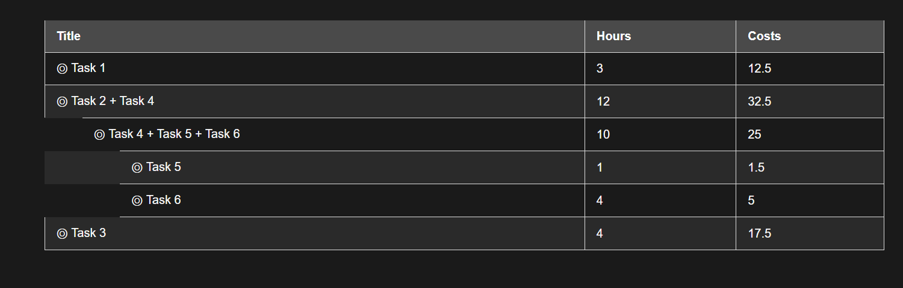

# VANILLA JS Draggable API
* We have a table with multiple rows
* The rows are draggable
* Draggable them up and down will change the order of the rows & the data
* Dragging them right & left will nest the rows in & out of other rows & the data
* There is extensive use of Depth First Search & Breadth First Search as the data structure demands

```js
let allTasks = [
    {id: 1, title: "Task 1", hours: 3, costs: 12.5, children: []},
    {id: 2, title: "Task 2", hours: 2, costs: 7.5,  children: [
        {id: 4, title: "Task 4", hours: 5, costs: 18.5, children: [
            {id: 5, title: "Task 5", hours: 1, costs: 1.5, children: []},
            {id: 6, title: "Task 6", hours: 4, costs: 5, children: []},
        ]},
    ]},
    {id: 3, title: "Task 3", hours: 4, costs: 17.5, children: []},
]
```

## Table preview

